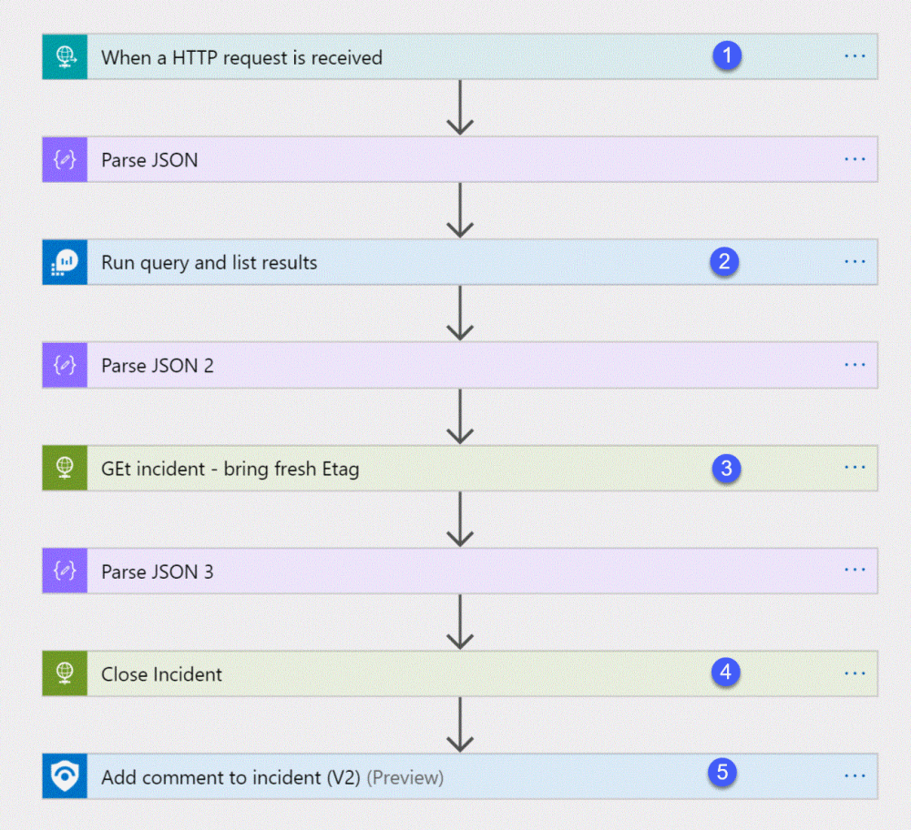
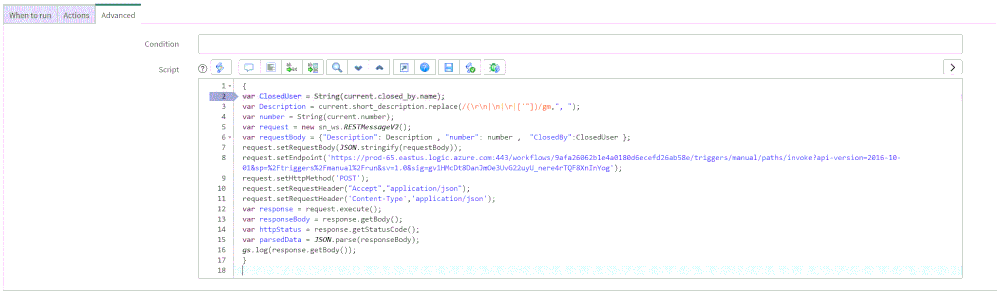

#  Close-SentinelIncident-From-Snow

**Author: Yaniv Shasha**

This Logic App listens for an incident close event from ServiceNow and will close the incident in Sentinel. It is meant to be used along with the [Create SNOW Record playbook](https://github.com/Azure/Azure-Sentinel/tree/master/Playbooks/Create-SNOW-record).

## Closing the incident in Azure Sentinel when it is closed in ServiceNow requires two components:

1.	A Business Rule in ServiceNow that run custom JS code when the incident is closed.
2.	A Logic App in Azure Sentinel that waits to the Business Rule POST request.

 


## Playbook overview:

The playbook works as follows:

1.	An HTTP POST from ServiceNow triggers the Logic App endpoint (1)
2.	The request details are parsed from the ServiceNow Incident and validated against Log Analytics (2-3) 
3.	The incident is closed in Azure Sentinel (4)
4.	A comment is Added to the Sentinel incindent that includes the name of the user who closed the incident in ServiceNow into an Azure sentinel incident comment (5) 

 

## Deploying the solution:

> Important
> 
> This Logic App requires that you have already deployed [the Create SNOW Incident Logic App found here](https://github.com/Azure/Azure-Sentinel/tree/master/Playbooks/Create-SNOW-record).
> 

### Deploy Logic App to Azure

You must first deploy the Logic App to your Azure subscription.

1. Click one of the following to deploy and sign in to Azure.
   
   [](https://portal.azure.com/#create/Microsoft.Template/uri/https%3A%2F%2Fraw.githubusercontent.com%2FAzure%2FAzure-Sentinel%2Fmaster%2FPlaybooks%2FClose-SentinelIncident-fromSNOW%2Fazuredeploy.json)
   [](https://portal.azure.us/#create/Microsoft.Template/uri/https%3A%2F%2Fraw.githubusercontent.com%2FAzure%2FAzure-Sentinel%2Fmaster%2FPlaybooks%2FClose-SentinelIncident-fromSNOW%2Fazuredeploy.json)

2. On the Custom deployment page

The incident properties that exported from Azure sentinel into ServiceNow incident page looks:


### Configure Logic App

1.	Copy the HTTP endpoint URL from the Logic App trigger part to use in the ServiceNow Business Rule.


2.	On *Run query and list results* (Step 2) authenticate with a user that has log analytics read permission or Azure Sentinel Reader role as a minimum requirement.

> Note
> 
> The Log Analytics Logic App connector works only with a user or service principal. [Managed identity support may be available in the future](https://docs.microsoft.com/en-us/answers/questions/263744/trouble-connecting-to-monitor-log-in-logic-app.html)

3.	On *Get incident – refresh ETAG* (Step 3) authenticate to AAD APP with a user or managed identity that has an Azure Sentinel Reader role.
4.	On *Close incident* (Step 4) authenticate use a user or managed identity that has an Azure Sentinel Responder role. 
5.	On *Add comment to incident* (Step 5) authenticate use a user or managed identity that has an Azure Sentinel Responder role.


### Configure ServiceNow Business Rule

A ServiceNow business rule is a server-side script that runs when a record is displayed, inserted, updated, or deleted, or when a table is queried.

To create the business rule

1. Login to your ServiceNow Instance.
1. In the left navigation type business rules, click *New* to create a new business rule.

> NOTE
> 
> For a business rule types and scopes refer to [ServiceNow documentation](https://docs.servicenow.com/bundle/orlando-application-development/page/script/business-rules/concept/c_BusinessRulesInScopedApps.html)

1. Give the business rule a name, select Incident as the table, and check the Active and the Advanced checkboxes.


1. On the “When to run” tab, configure the controls as depicted on the screenshot below.


1. On the Advance tab, paste the above (like the picture below)

 

1. Replace the URL on line 8 with the HTTP POST URL trigger that you copied from the first step of the Logic App above.
 
```powershell
{
    var ClosedUser = String(current.closed_by.name);
    var Description = current.short_description.replace(/(\r\n|\n|\r|['"])/gm,", ");
    var number = String(current.number);
    var request = new sn_ws.RESTMessageV2();
    var requestBody = {"Description": Description , "number": number ,  "ClosedBy":ClosedUser };
    request.setRequestBody(JSON.stringify(requestBody));
    request.setEndpoint('https://prod-65.eastus.logic.azure.com:443/workflows/<guid>/triggers/manual/paths/invoke?api-version=2016-10-01&sp=%2Ftriggers%2Fmanual%2Frun&sv=1.0&sig=gv1HMcDt8DanJmOe3UvG22uyU_nere4rTQF8XnInYog');
    request.setHttpMethod('POST');
    request.setRequestHeader("Accept","application/json");
    request.setRequestHeader('Content-Type','application/json');
    var response = request.execute();
    var responseBody = response.getBody();
    var httpStatus = response.getStatusCode();
    var parsedData = JSON.parse(responseBody);
    gs.log(response.getBody());
}
```

In the above example, only three properties are sent to Azure Sentinel:

- *ClosedBy* – the username that closed the incident in Service Now
- *Description* – the incident description
- *Number* – the incident ID, originally received from Azure Sentinel.

You can modify the business rule JavaScript to add other properties to be sent to the Logic App.